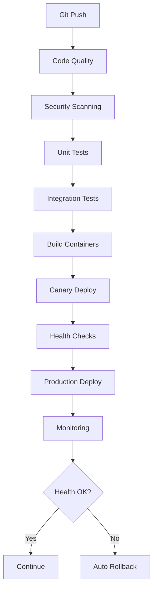

# Comprehensive CI/CD Pipeline Showcase

A complete end-to-end CI/CD pipeline demonstration for polyglot microservices applications featuring automated testing, security scanning, containerization, and progressive deployment strategies.

## 🚀 Key Features

- **Polyglot Architecture**: TypeScript, Python, and Go microservices
- **Multi-stage Pipeline**: Code quality → Security → Testing → Build → Deploy → Monitor
- **Advanced Security**: SAST/DAST scanning with multiple tools
- **Progressive Deployments**: Canary and Blue-Green strategies
- **Automated Monitoring**: Prometheus metrics with auto-rollback
- **GitHub Actions**: Fully automated CI/CD workflows

## 🏗️ Services Architecture

| Service | Language | Framework | Port | Purpose |
|---------|----------|-----------|------|---------|
| **User Service** | TypeScript | Express.js | 3001 | User management & auth |
| **Order Service** | JavaScript | Express.js | 3002 | Order processing |
| **Product Service** | JavaScript | Express.js | 3003 | Product catalog |
| **Notification Service** | Python | FastAPI | 3002 | Email/SMS/Push notifications |
| **Analytics Service** | Go | Gin | 3003 | Event tracking & analytics |

## 🛠️ Technology Stack

```
CI/CD: GitHub Actions
Containerization: Docker
Orchestration: Kubernetes
Monitoring: Prometheus + AlertManager
Security: CodeQL, Snyk, Trivy, Gosec
Testing: Jest, Pytest, Go test
Languages: TypeScript, Python, Go
```

## 🔄 Pipeline Workflow



## 🚀 Quick Start

```bash
# Clone and setup
git clone <repo-url>
cd cicd-pipeline

# Install dependencies
npm install

# Run all tests
npm test

# Start services locally
npm run dev
```

## 🔧 Pipeline Stages

### 1. Code Quality Assurance
- ESLint/Prettier for code formatting
- TypeScript compilation with strict type checking
- Language-specific linting (PyLint, Go vet)

### 2. Security Scanning
- **SAST**: CodeQL semantic analysis
- **Dependencies**: Snyk, Safety, Gosec
- **Containers**: Trivy vulnerability scanning

### 3. Automated Testing
- Unit tests with coverage reporting
- Integration tests with MongoDB
- Cross-version compatibility testing

### 4. Container Building
- Multi-stage Docker builds
- Registry integration (Docker Hub)
- Semantic versioning and tagging

### 5. Progressive Deployment
- Canary releases to staging
- Blue-green production deployments
- Health checks and readiness probes

### 6. Monitoring & Rollback
- Prometheus metrics collection
- Custom alert rules
- Automated rollback on failure

## 📊 Monitoring Dashboard

Access monitoring at:
- **Prometheus**: `http://localhost:9090`
- **Alerts**: Configured for service health
- **Metrics**: Available at `/metrics` endpoints

## 🔐 Security Features

### Static Analysis
- CodeQL for all languages
- Custom security rules
- Vulnerability pattern detection

### Dependency Scanning
- Real-time CVE monitoring
- License compliance checking
- Outdated package detection

### Runtime Security
- Container image scanning
- Network policy enforcement
- Secret management

## 🎯 Deployment Strategies

### Canary Deployment
Gradually rollout to subset of users:
```yaml
replicas: 1  # Start small
trafficPolicy: 
  canary:
    weight: 10%  # Increase gradually
```

### Blue-Green Deployment
Zero-downtime production releases:
- Maintain parallel environments
- Instant traffic switching
- Quick rollback capability

## 📈 Performance Metrics

- **Build Time**: ~3-5 minutes per service
- **Test Coverage**: >80% across all services
- **Deployment Time**: ~2-3 minutes to staging
- **Rollback Time**: <30 seconds on failure

## 📚 Documentation

- [Complete Pipeline Guide](docs/complete-pipeline-guide.md)
- [Security Configuration](configs/security-config.json)
- [Monitoring Setup](configs/prometheus.yml)
- [Deployment Strategies](k8s/)

## ⚙️ Prerequisites

- **Node.js** 18+
- **Python** 3.11+
- **Go** 1.21+
- **Docker** and **Kubernetes**
- **MongoDB** and **Redis**
- **GitHub** account for CI/CD

## 🤝 Contributing

1. Fork the repository
2. Create feature branch
3. Follow existing code patterns
4. Add tests for new functionality
5. Submit pull request

## 📄 License

MIT License - see LICENSE file for details

---

*Built with ❤️ using modern DevOps practices*